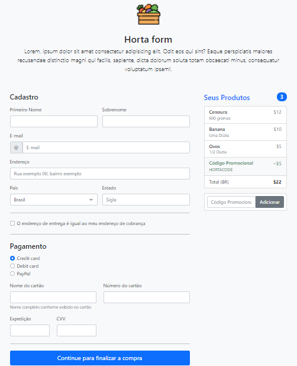

# Projeto_horta 

Projeto feito para disciplina de Fundamentos da Internet do CEFET-RJ no ano letivo de 2021.

> **Link para o [Site para o Formulário da Horta](https://rafaelabf.github.io/Projeto_horta/)**

## Ferramentas usadas 🔧

 &nbsp;&nbsp;&nbsp;&nbsp; &nbsp;

## 💻 Desenvolvedora:

- 👩🏻‍💻 RAFAELA BEZERRA DE FIGUEIREDO. 

## Professor da disciplina 👨🏻‍🏫

- RENATO CAMPOS MAURO
